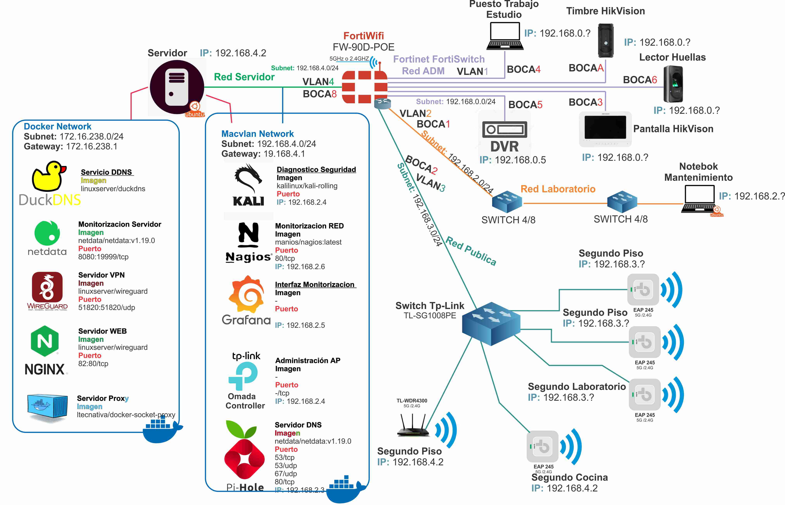
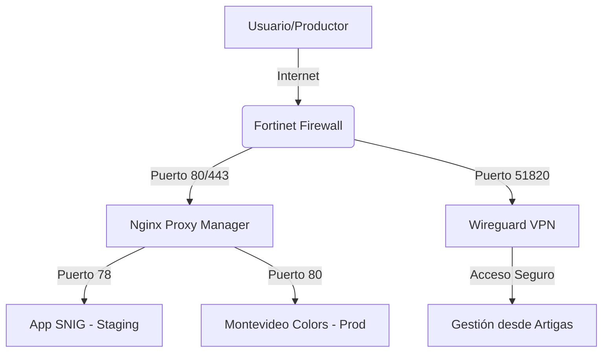

<!> Aca quiero poner un logo  o un acet con la mara 
<!> Tambien agregaria un link a la pagina web 


# NorthCode Infrastructure 🚀

Este repositorio contiene la configuración de infraestructura como código (IaC) para los servicios de **NorthCode**. Nuestra arquitectura está diseñada para ofrecer baja latencia en Uruguay y máxima seguridad para los datos de productores rurales.

## 🌐 Arquitectura de Red
Contamos con una infraestructura distribuida:
- **Nodo de Cómputo:** Servidor Linux montado en DigitalOcean.
- **Gestión Remota:** Administración segura desde Artigas mediante túneles **Wireguard (VPN)**.
- **Acceso Público:** Gestión de tráfico mediante **Nginx Proxy Manager** con certificados SSL automáticos.


<details>
  <summary><b>📂 Estructura del Proyecto</b></summary>
  <br>
  <pre>
    ├── docs/                   # Documentación técnica y diagramas
    │   ├── network-diagram.md  # Explicación de la red Artigas-Montevideo
    │   └── security-policy.md  # Políticas de seguridad y firewall
    ├── stacks/                 # Orquestación de servicios Docker
    │   ├── production/         # Servicios críticos (VPN, Proxy, DNS)
    │   │   ├── .env.example    # Molde de variables de entorno
    │   │   └── docker-compose.yml
    │   └── staging/            # Entorno de pruebas y demos
    │       ├── .env.example
    │       └── docker-compose.yml
    ├── .gitignore              # Reglas de exclusión de Git (Centralizado)
    └── README.md               # Documentación principal del proyecto
  </pre>
</details>

## 🛠️ Tecnologías Utilizadas
- Docker & Docker Compose: Containerización y orquestación.
- Wireguard: VPN de alto rendimiento y baja latencia.
- Nginx Proxy Manager: Reverse Proxy y gestión de SSL (Let's Encrypt).
- DuckDNS: DNS dinámico para garantizar acceso remoto persistente.

## 📊 Topología de Red
<!> Esta imagen hay que cambiarla por la que va pero tengo que diseniar el diagrama. 


## 🚀 Despliegue Rápido
1. Clonar el repositorio:
```bash
git clone https://github.com/tu-usuario/northcode-infra.git
cd northcode-infra/stacks/production
```
2. Configurar las variables de entorno:
```bash
cp .env.example .env
nano .env
```
3. Iniciar los servicios:

```bash
docker compose up -d
```
## 🔒 Seguridad

- Zero Trust: El acceso administrativo (SSH, Panel de Nginx) está restringido a la red interna de la VPN.
- Aislamiento: Los entornos de production y staging corren en stacks separados para evitar interferencias.
- Protección de Datos: No se almacenan credenciales ni datos sensibles en el control de versiones.


<!> Esto no se que es ni qeuda bien. creo 




## 🛠️ Configuración de Red (Manual)

Nuestra infraestructura utiliza una arquitectura de stacks desacoplados. Para permitir la comunicación entre el **Proxy de Producción** y las **Apps de Staging**, debemos crear una red virtual persistente:

```bash
# Crear la red puente de NorthCode
docker network create northcode-net
```

